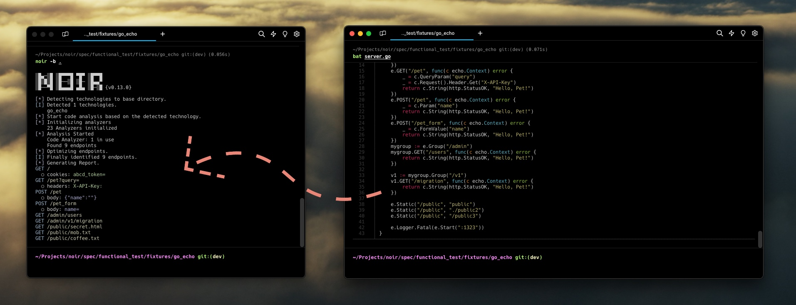

---

layout: col-sidebar
title: OWASP Noir
tags: noir owasp-noir sast dast ai-sast llm attack-surface endpoint shadow-api
level: 2
type: code
pitch: Hunt every Endpoint in your code, expose Shadow APIs, map the Attack Surface.

---

  
  
Hunt every Endpoint in your code, expose Shadow APIs, map the Attack Surface.

Noir is a SAST tool that reads source code and extracts the endpoints an application exposes — paths, methods, parameters, headers, cookies, and the source files behind them. Shadow APIs, deprecated routes, and undocumented handlers come out as part of the same inventory; they aren't a separate mode.

The inventory feeds three audiences:

- **Human reviewers.** Security engineers and code auditors get a focused list of attacker-reachable entrypoints — paths, parameters, source files, tags — instead of skimming the whole repo.
- **AI auditors.** LLM-based SAST agents get the same focused list, plus per-endpoint review context (`--include-callee` for 1-hop callees, `--ai-context` for guards, sinks, validators, and signals).
- **DAST tools.** ZAP, Burp Suite, and Caido get a real route list to scan, including paths they would never have reached by crawling.

For more information, please visit our [documentation page](https://owasp-noir.github.io/noir/).

## What Noir does

- **Endpoint extraction.** Static analysis across 50+ frameworks. Returns endpoints, parameters, headers, cookies, and the source files they came from.
- **LLM fallback.** Hand unsupported frameworks (or one-off custom routing) to OpenAI / Ollama / etc. when static rules don't apply.
- **Output for the next stage.** JSON, YAML, OpenAPI, SARIF, cURL, Postman, HTML — whichever format the next tool in the pipeline reads.
- **DAST integration.** Pipe directly into ZAP, Burp Suite, or Caido as a proxy target, or export OpenAPI for them to import.
- **AI SAST context.** The endpoint inventory (and, with `--include-callee`, the 1-hop functions each handler invokes) is the focused context an LLM auditor needs to find attacker-reachable bugs. `--ai-context` goes further and attaches aggregated review context per endpoint — guards, callees, sinks, validators, and signals — so the LLM doesn't have to rediscover them.
- **CI/CD.** GitHub Action, SARIF output, exit codes — fits the pipeline you already have.

## Road Map

Noir started as a WhiteBox testing aid: extract endpoints from source so DAST can scan them more accurately. The job has grown — the same inventory now feeds human auditors and AI SAST agents too. The goal from here is to serve all three consumers equally well: humans reviewing the code, LLMs auditing it, and DAST tools scanning it.

From here:

- Broaden language and framework coverage; keep accuracy honest with per-framework fixtures.
- Lean harder on LLMs for the cases static analysis can't reach.
- Enrich the per-endpoint review context (guards, callees, sinks, validators, signals) so human reviewers and AI auditors share the same focused view of each handler.
- Keep DAST integration first-class — OpenAPI, proxy targets, and direct hand-offs to ZAP / Burp / Caido.

